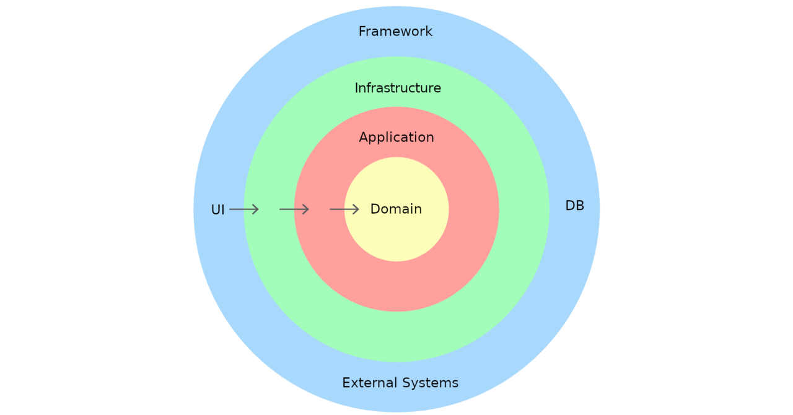

DDD 등장배경
도메인 객체(Order, Product, Customer)는 그냥 데이터 운반체. getter/setter만 있고 로직 없음.
Service 클래스가 5000줄짜리 괴물이 됨
- 같은 규칙이 여러 Service에 복붙됨 (Order 만들 때, 수정할 때, 환불할 때…)
- 이렇게되면서 서비스마다 도메인 규칙이 일치하지 않을 수 있음
- 비즈니스 담당자랑 개발자가 같은 단어를 다르게 씀 ("주문 확정"이 코드 어디에 있는지 아무도 모름)
- 관련한 로직(메서드)들이 중복이 일어남
- 서비스 계층의 코드가 깔끔해지고 가독성도 늘어남

지휘자(Service)가 하는 일:

1. 불러오기 — Repository로 도메인 객체 가져오기
2. 시키기 — 도메인 객체의 메서드 호출 (단, 규칙 판단은 안 함)
3. 저장하기 — 결과를 Repository로 저장
4. 트랜잭션 묶기 — "이 작업들은 다 같이 성공하거나 다 같이 실패해야 한다"는 경계 긋기

만약 Service에 if (product.stock < quantity) throw ... 같은 게 또 생기면? → 그건 "어? 이 규칙은 Product 안으로 들어가야 하는 거 아냐?"라는 신호야. 너가
아까 느꼈던 그 "흩어진 느낌"이 다시 도지는 거지.

(물론 if (product == null) 같은 "데이터 있냐 없냐" 체크는 Service에 있어도 괜찮아. 그건 업무 규칙이 아니라 흐름 제어니까. 이 구분은 나중에 더 깐깐하게 다룰게.)

직관적으로는 이게 자연스러워 보여:

class OrderItem(
val product: Product,   // ← 상품 객체를 통째로 들고 있기
val quantity: Int
)

"주문 항목엔 상품이 들어가니까 Product를 넣는다" — 객체지향적으로 그럴듯하지? 근데 DDD는 이걸 하지 말라고 해. 대신 이렇게:

class OrderItem(
val productId: Long,    // ← 상품의 id만 (남의 집 주소만 적어둠)
val orderPrice: Money,
val quantity: Int
)

다른 애그리거트는 통째로 품지 말고, id(주소)로만 가리켜라. 이게 원칙이야. 왜 그럴까. 이유 3개를 줄게.

---

이유 ①: "한 묶음 = 한 트랜잭션" 경계가 무너져

아까 애그리거트는 "한 덩어리로 같이 저장되고 같이 불려나온다"고 했지?

만약 OrderItem이 Product를 통째로 품으면, Order를 불러올 때 Product도 줄줄이 딸려 나와. 그러다 누가 실수로 이런 코드를 짜:

val order = orderRepository.findById(1001)
order.items[0].product.price = Money(50000)   // 😱 주문 고치다가 진열대 상품 가격이 바뀜!

주문서를 만지다가 진열대 상품 정보가 바뀌는 사고가 나. 경계가 흐물흐물해진 거지. id로만 가리키면 애초에 order를 통해 Product에 손댈 방법이 없으니까, 이
사고가 원천 차단돼.

▎ 원칙: 하나의 트랜잭션에서는 하나의 애그리거트만 바꾼다. Order 바꿀 땐 Order만, Product 바꿀 땐 Product만.

이유 ②: 수명(생명주기)이 서로 달라

- Product: 주문이 취소되든 말든 진열대에 계속 살아있어. 1년 뒤에도 있어.
- Order: 주문 시점에 생겼다가, 나름의 인생(결제→배송→완료)을 살아.

OrderItem이 Product를 품고 있으면, "이 Product를 삭제해도 되나? 주문들이 붙들고 있는데?" 같은 골치 아픈 의존이 생겨. 서로 남남으로 두고 id로만 연결하면
각자 독립적으로 살고 죽을 수 있어.

(그리고 이미 배웠지? OrderItem은 가격을 박제하니까 Product가 사라져도 주문서는 멀쩡해. → id 참조랑 박제는 한 세트야.)

이유 ③: 통째로 품으면 너무 무거워

Order에 Product가 붙고, Product엔 또 Category, Review, Seller가 붙어있다고 해봐. 주문 하나 불러왔을 뿐인데:

Order → Product → Category → ...
→ Reviews (수천 개) 😵
→ Seller → Shop → ...

객체 그래프가 끝없이 딸려 나와. 주문 상태만 바꾸고 싶었을 뿐인데 DB에서 온 세상이 다 끌려나오는 거야. id로만 가리키면 딱 필요한 애그리거트만 가볍게 다룰
수 있어.

"스냅샷이면 사진/상품명도 옛날 걸 써야 하는 거 아냐?"

답: 필드마다 다르고, 그건 비즈니스가 정한다. 두 부류로 나뉘어.

① 반드시 박제해야 하는 것 (계약/법적 의미)

- 가격 → 무조건 박제. "내가 그때 낸 돈"은 바뀌면 안 됨. 환불·세금·정산의 근거니까.
- 주문 당시 상품명도 보통 박제해. → "내가 주문한 게 [나이키 에어맥스 2024]였다"는 기록이 남아야 분쟁 때 증거가 돼. 사장님이 나중에 상품명을 [에어맥스
  신형]으로 바꿔도, 내 주문서엔 그때 이름이 남아야 하잖아.

② 박제 안 해도 되는 것 (그냥 보여주기용)

- 상품 이미지 → 보통 박제 안 해. 굳이 주문 시점 사진을 보존할 법적 이유가 없거든. 그래서 화면 보여줄 때 productId로 현재 Product의 이미지를 가져다
  보여줘도 돼.

그래서 아까 그 조합 코드가 의미가 있는 거야:

return OrderDetailResponse(
productName = orderItem.productName,        // 박제된 옛날 이름 (주문서 기록)
paidPrice   = orderItem.orderPrice,         // 박제된 옛날 가격 (계약 금액)
imageUrl    = product.currentImageUrl,      // 현재 상품 이미지 (그냥 보여주기용)
)

한 화면에 "박제된 과거"와 "살아있는 현재"가 섞여 있는 거야. 어느 쪽으로 할지는 코드가 정하는 게 아니라, "우리 쇼핑몰이 이 데이터를 어떤 의미로 다루느냐"가
정해.

▎ 💡 이게 DDD가 말하는 거야: 설계 결정은 기술이 아니라 도메인(업무)의 의도에서 나온다. "사진은 최신으로 보여주자 vs 주문 당시로 보존하자"는 개발자가
▎ 아니라 기획/비즈니스가 답할 문제고, 코드는 그 결정을 반영할 뿐이야.

(참고로 쿠팡 같은 데서 옛날 주문 들어가면, 가격은 그때 그 가격인데 상품 페이지로 들어가면 현재 상품이 뜨지? 딱 이 구조야.)

너 이거 스스로 의심한 거 진짜 좋은 감각이야. 넘어가지 말고 잡았잖아.

밸류 오브젝트 (Value Object)

아까부터 내가 Money라고 썼지? Int price 안 쓰고 왜 굳이 Money라는 객체를 만들까. 이걸 풀어줄게.

문제 상황: 원시 타입(primitive)의 함정

가격을 그냥 Int로 다룬다고 해보자:

class OrderItem(
val price: Int,      // 원
val quantity: Int
)

fun totalPrice(): Int = price * quantity

별 문제 없어 보이지? 근데 이런 사고들이 도사리고 있어:

val price: Int = -5000           // 😱 음수 가격? Int는 막아주질 않아
val total = price + quantity     // 😱 가격 + 수량?? 둘 다 Int라서 컴파일 통과됨!
discount(price, quantity)        // 😱 인자 순서 바꿔 넣어도 둘 다 Int라 모름

Int는 "그냥 숫자"라서, 이게 돈인지 개수인지 온도인지 컴파일러가 구분을 못 해. 그래서 돈끼리 더해야 할 걸 수량이랑 더해도 멀쩡히 돌아가버려. 버그의
온상이지.

해결: "돈"이라는 개념을 객체로 만든다

val price = Money(5000)
val total = price * 3              // Money(15000) ✅ 돈 × 개수 = 돈, 의미가 맞음
val sum   = price + Money(1000)    // ✅ 돈 + 돈 = 돈

val wrong = price + quantity       // ❌ 컴파일 에러! Money랑 Int는 못 더해
Money(-5000)                       // ❌ 실행 즉시 예외! 음수 금액 차단

개념을 타입으로 만드니까, 말이 안 되는 연산은 아예 컴파일이 안 돼. 버그가 런타임이 아니라 컴파일 타임에 잡혀. 이게 밸류 오브젝트의 첫 번째 힘이야.

밸류 오브젝트의 핵심 성질 2가지

밸류 오브젝트(VO)가 엔티티(Order, Product)랑 뭐가 다르냐면:

① 식별자(id)가 없다. "값 자체"로 같은지 판단한다.

Money(5000) == Money(5000)   // true. 5000원은 그냥 5000원이야.

5000원짜리 지폐 두 장은 "같은 5000원"이지, "1번 5000원 / 2번 5000원"으로 구분 안 하잖아? VO는 id가 없고 값이 같으면 같은 거야.

반면 엔티티는 id로 구분해 → 김철수(id=1)랑 동명이인 김철수(id=2)는 이름·나이가 같아도 다른 사람이지. (이 "VO는 값으로, 엔티티는 id로 구분" 이 대비가
핵심이야.)

② 불변(immutable)이다. 한 번 만들면 안 바뀐다.

5000원을 6000원으로 "수정"하지 않아. 그냥 새로운 Money(6000)을 만들어 갈아끼워. 숫자 5를 6으로 "고친다"고 안 하고 그냥 6을 쓰는 것처럼. (위 코드에서
plus가 자기를 바꾸지 않고 새 Money를 반환하는 거 봤지? 그게 불변성이야.)

---

쇼핑몰에서 VO로 만들면 좋은 것들

Int, String으로 대충 다루지 말고 개념으로 묶으면 좋은 것들:

- Money — 돈 (가격, 합계, 할인액)
- Address — 배송지 (우편번호 + 도로명 + 상세주소를 한 덩어리로)
- Email — 이메일 (형식 검증을 생성자에 넣어서, 잘못된 이메일은 객체 자체가 못 생기게)
- Quantity — 수량 (1개 이상이어야 한다는 규칙 박제)

@JvmInline
value class Email(val value: String) {
init {
require(value.contains("@")) { "이메일 형식이 아님" }
}
}
// 이러면 시스템 어디서도 "@ 없는 이메일"이라는 잘못된 상태가 존재할 수 없게 됨

이게 핵심 효과야: 잘못된 값은 객체가 태어나는 순간 막히니까, 그 뒤로는 "이 값이 유효한가?" 검사를 안 해도 돼. 검증이 여기저기 흩어지던 걸(기억나지? 첫날
얘기한 그 흩어짐) 또 한 번 막는 거지.

---

한 줄 요약

▎ 밸류 오브젝트 = id 없이 값 자체로 동등성을 판단하는 불변 객체.
▎ Int, String 같은 원시 타입 대신 Money, Email처럼 개념을 타입으로 만들면:
▎ ① 말 안 되는 연산이 컴파일에서 막히고 ② 잘못된 값이 생성 단계에서 차단된다.

도메인 이벤트 (Domain Event)

문제 상황부터: Service가 점점 뚱뚱해진다

"주문이 완료되면" 뒤따라야 할 일들을 생각해봐:

class OrderService {
@Transactional
fun completeOrder(orderId: Long) {
val order = orderRepository.findById(orderId)
order.complete()                      // ← 진짜 핵심: 주문 완료 처리

```
      // ⬇️ 근데 그 뒤에 줄줄이 딸려오는 후속 처리들...
      pointService.accumulate(order)        // 포인트 적립
      emailService.sendCompletionMail(order) // 완료 메일
      smsService.send(order)                // 알림 문자
      couponService.issueReorderCoupon(order) // 재구매 쿠폰 발급
      slackService.notifyAdmin(order)       // 관리자 알림
  }
```

}

뭐가 문제일까. 천천히 보자:

1. Service가 너무 많은 걸 알아. 주문 완료시키는 게 본업인데, 포인트·메일·문자·쿠폰·슬랙을 다 알아야 해. 의존성(생성자 인자)이 5개로 불어났어.
2. 기능 추가할 때마다 이 메서드를 건드려야 해. "카카오 알림톡도 보내자" → 또 여기 한 줄 추가. 핵심 로직이랑 후속 처리가 한 덩어리로 엉켜.
3. 메일 서버가 죽으면 주문 완료가 통째로 실패해. 한 트랜잭션에 다 묶여 있으니까. 메일 좀 안 갔다고 주문이 롤백되는 건 말이 안 되잖아.

이거 어디서 본 냄새지 않아? 첫날 그 "흩어지고 엉키는" 느낌. 이번엔 Service 안에서 핵심과 곁가지가 엉킨 거야.

---

해결: "주문이 완료됐다!"고 외치기만 한다

발상을 바꿔. 주문은 그냥 "나 완료됐어!"라고 외치고(이벤트 발행) 끝. 그 외침을 듣고 누가 뭘 하든 주문은 신경 안 써.

// ① 이벤트 = "이런 일이 일어났다"는 사실. 과거형으로 짓는 게 관례.
data class OrderCompletedEvent(
val orderId: Long,
val userId: Long,
val totalAmount: Money,
)

// ② Order(또는 Service)는 "외치기"만 한다
class OrderService {
@Transactional
fun completeOrder(orderId: Long) {
val order = orderRepository.findById(orderId)
order.complete()                              // 핵심만!

```
      eventPublisher.publish(OrderCompletedEvent(   // "나 완료됐어!" 외침
          order.id, order.userId, order.totalAmount
      ))
      // 끝. 포인트가 뭔지 메일이 뭔지 이제 몰라도 됨.
  }
```

}

// ③ 듣는 사람들(핸들러)이 각자 알아서 반응
@Component
class PointEventHandler {
@EventListener
fun handle(event: OrderCompletedEvent) {
pointService.accumulate(event.userId, event.totalAmount)  // 나는 포인트만 챙긴다
}
}

@Component
class MailEventHandler {
@EventListener
fun handle(event: OrderCompletedEvent) {
emailService.sendCompletionMail(event.orderId)            // 나는 메일만 챙긴다
}
}

---

뭐가 좋아졌어?

① 주문은 후속 처리를 몰라도 된다 (관심사 분리)
OrderService의 의존성 5개가 eventPublisher 하나로 줄었어. 주문은 "완료됐다"는 사실만 알리고, 그걸로 뭘 하든 남의 일.

② 기능 추가가 곁가지에서 끝난다 (확장에 열림)
"카카오 알림톡 추가" → OrderService는 한 글자도 안 건드리고, KakaoEventHandler 클래스 하나만 새로 만들면 끝. 핵심 로직은 그대로 둔 채 곁가지만 붙이는
거야. (← 이게 클린아키가 추구하는 "변경에 강한 구조"의 실제 모습이야.)

③ 핵심과 곁가지의 실패를 분리할 수 있다
"주문 완료는 확실히 커밋하고, 메일·포인트는 그 다음에 처리해라" 하고 끊을 수 있어.

@Component
class MailEventHandler {
// 주문 트랜잭션이 "커밋된 후에" 실행 → 메일 실패해도 주문은 멀쩡
@TransactionalEventListener(phase = AFTER_COMMIT)
fun handle(event: OrderCompletedEvent) { ... }
}

이러면 메일 서버가 죽어도 주문 완료는 안전하게 남아. 핵심(주문)과 곁가지(메일)의 운명을 분리한 거야.

---

언제 쓰고, 언제 안 써?

⚠️ 모든 걸 이벤트로 만들면 오히려 흐름 추적이 어려워져 (어디서 뭐가 실행되는지 코드 따라가기 힘듦). 그래서 기준이 있어:

- 이벤트로 → "주문 완료 → 알림/포인트/통계"처럼 핵심이 끝난 뒤 따라오는 부수 효과, 특히 다른 도메인(포인트, 알림)의 일
- 그냥 직접 호출 → "재고 차감"처럼 주문 성공에 꼭 필요해서 같이 성공/실패해야 하는 일은 이벤트로 빼지 말고 그냥 Service에서 직접 (한 트랜잭션 안에서)

핵심 판단: "이게 실패하면 주문도 취소돼야 하나?" → Yes면 직접 호출, No면 이벤트 후보.

"개발자만의 것이 아니다"

이건 100% 맞아. DDD의 출발점이 바로 이거야:

▎ "도메인(업무)을 가장 잘 아는 사람은 개발자가 아니라 그 업무 전문가다."

쇼핑몰이면 — "배송된 주문은 취소 불가", "포인트는 결제 완료 후 적립" 같은 규칙은 기획자/CS/운영팀이 더 잘 알아. 개발자가 혼자 상상해서 만들면 현실이랑
어긋나.

그래서 DDD는 이렇게 주장해:

▎ 개발자랑 업무 전문가가 "같은 단어"로 대화하고, 그 단어가 코드에도 똑같이 나타나야 한다.

이걸 유비쿼터스 언어(Ubiquitous Language, 보편 언어) 라고 불러. 예를 들어:

- 기획자가 "주문 취소"라고 부르면 → 코드도 order.cancel()
- CS가 "배송 시작"이라 부르면 → 코드도 ship() (updateStatus(2) 같은 거 ❌)

회의에서 쓰는 말, 기획서의 말, 코드의 메서드 이름이 전부 같은 단어가 되도록. 그래야 "기획자가 말한 거"랑 "개발자가 만든 거" 사이 번역 손실이 없어져. 네가
만든 cancel(), pay()가 그냥 메서드 이름이 아니라 업무 용어 그 자체인 게 이래서 중요한 거야.

---

🔧 살짝 다듬을 부분: "정책 주도"라기보단 "업무(언어) 주도"

"기획/정책 주도"라고 하면 살짝 좁아져. 차이를 보면:

- 정책/규칙 = "배송되면 취소 불가" 같은 개별 조건. → 이건 도메인의 일부분이야.
- 도메인 = 그 규칙들 + 개념/용어/관계 전체. "주문이란 뭔가, 상품이란 뭔가, 이것들이 어떻게 엮이나" 같은 업무 세계 전체.

그러니까:

▎ DDD = "정책 주도"보다는 "업무 언어/개념 주도" 에 가까워.
▎ 정책(규칙)은 그 안에 포함되는 한 조각이고.

비유하면 — 정책은 "법 조항 하나하나"고, 도메인은 "그 법이 다루는 세계 전체(+그 세계의 단어)"야.

---

한 줄 정리

▎ 네 직관 맞아 — 도메인은 개발자 전유물이 아니라 업무 전문가와 공유하는 것이고, 같은 언어(유비쿼터스 언어)로 말해야 한다.
▎ 다만 "정책 주도"보단 "업무 개념·언어 주도" 가 더 정확해. 정책은 도메인의 한 조각이니까.